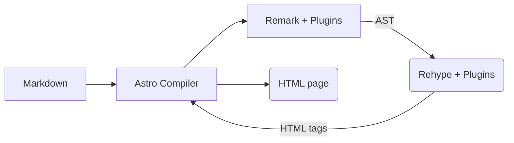

Markdown is commonly used to store textual contents when building a site with Astro. During the build process, Astro will take
all markdowns transform them into its HTML equivalent. Users can then style the markups with CSS however they wish.

However, customization through CSS is pretty limited as customizing the actual markup or behavior is out of the table. To allow
greater degree of customization, users can opt-in to [MDX](https://docs.astro.build/en/guides/integrations-guide/mdx/).

MDX allows users to utilize custom components with markup-like syntax similar to how we use those components in Astro files or JSX.

```markdown title=Using custom components in MDX
---
title: 'Hello World!'
publishedAt: 2024-12-17
---
import MyComponent from 'path/to/component.astro';

<MyComponent>
  Hello World!
</MyComponent>
```

However, this is impractical when users want to replace default elements as they
are forced to use JSX-like syntax for every element and lose the simplicity of defining elements in markdown.

Fortunately, MDX also allows users to re-map HTML elements into custom components
by exporting component map in MDX files as `components` constant.


```markdown title=Replacing default elements with custom elements,{8-11}
---
title: 'Hello World!'
publishedAt: 2024-12-17
---

import Head1 from 'path/to/Head1.astro';

export const components = {
  // Replace <h1> with Head1
  h1: Head1,
}
```

Alternatively, users can also provide the mapped components by passing them as a prop to the `<Content />` element

```astro title=Passing component mapping via <Content />,{6-8}
---
import { Content } from 'path/to/Content.mdx';
import Head1 from 'path/to/Head1.astro';
---

<Content components={{
  h1: Head1,
}}>
```

After seeing the syntax, you might be wondering: how do I manage the props? What attributes are passed to the mapped element?
Can I apply a pre-defined CSS classes to mapped elements?

Unfortunately, it seems that [Astro's MDX integration documentation](https://docs.astro.build/en/guides/integrations-guide/mdx/) only touches
the surface of this syntax and the [official MDX documentation](https://mdxjs.com/table-of-components/) only tells you about what elements
that can be re-mapped.

This post will guide you through customizing default markdown elements using the `components` syntax. We will using the default code snippets
component as the guinea pig and upgrade them into similar code snippets that you see in this site.


> I will be using [UnoCSS](https://unocss.dev/) for styling, which is an alternative of [TailwindCSS](https://tailwindcss.com/). However, the styling can 100% be implemented with vanilla CSS.

## Deconstructing the Code Snippet

Before moving on to the actual customization of the snippet, we need to understand how Astro handles markdown files.

For each markdown file, Astro will parse the content using a processor called [remark](https://github.com/withastro/astro/tree/main/packages/markdown/remark),  which is a part of the
[unified](https://unifiedjs.com/) toolchain. From the markdown, remark will produce an [abstract syntax tree](https://en.wikipedia.org/wiki/Abstract_syntax_tree) (AST). The AST will
then be transformed into HTML tags using another processor in the same toolchain: [rehype](https://github.com/rehypejs/rehype).

> You might be wondering why we need to transform the markdown into an AST and not directly use something like RegExp.
> <br />
> This is because markdown (and HTML) is not a [regular language](https://en.wikipedia.org/wiki/Regular_language). Trying to parse non-regular language with **regular** tends to be error prone.

The functionality of remark and rehype can be augmented using [plugins](https://unifiedjs.com/learn/guide/create-a-rehype-plugin/) that provides additional features,
such as custom syntax and syntax highlighting.

By default, Astro enables [GitHub-flavored markdown](https://github.github.com/gfm/) and [SmartyPants](https://github.com/silvenon/remark-smartypants)
plugin to extend the basic markdown syntax. For syntax highlighting, Astro uses [Shiki](https://shiki.matsu.io/packages/rehype) by default or
users can opt-in to [Prism](https://prismjs.com/); both available as Rehype plugins.

The diagram below shows a simplified pipeline of markdown transformation to HTML that occurs during the build process.



When processing code blocks, the process above will output HTML tags similar to the following:

```html title=Example HTML output of a code block after Remark + Rehype pipeline.
<pre
	class="astro-code github-dark"
	style="background-color:#24292e;color:#e1e4e8;overflow-x:auto"
	tabindex="0"
	data-language="js"
>
	<code>
    <span class="line">
      <span style="color:#F97583">&lt;!</span>
      <span style="color:#E1E4E8">doctype html</span>
      <span style="color:#F97583">&gt;</span>
    </span>
    <span class="line">
      <span style="color:#E1E4E8">&lt;</span>
      <span style="color:#85E89D">html</span>
      <span style="color:#B392F0"> lang</span>
      <span style="color:#F97583">=</span>
      <span style="color:#9ECBFF">"en"</span>
      <span style="color:#E1E4E8">&gt;</span>
    </span>
    <span class="line">
      <span style="color:#E1E4E8">  &lt;</span>
      <span style="color:#85E89D">head</span>
      <span style="color:#E1E4E8">&gt;</span>
    </span>
    <!-- and the rest of the tags -->
	</code>
</pre>
```

This HTML tags will then be used by Astro to replace code blocks during the markdown
transformation process into an HTML page for:

- All code fences (\`\`\`) defined in Markdown and MDX files.
- Content defined with `<Code />` or `<Prism />` component.

## Replacing The Default Code Snippet

Our first step to customize the code snippet is by replacing the default component with
a custom component that wraps the original one using Astro `<slot />`.

To do that, we can assign a custom mapping for HTML elements by exporting a new constant
called `components` in our MDX files.

```markdown title=hello-world.mdx,{8-11}
---
title: 'Hello World!'
publishedAt: 2024-12-17
---

import CodeSnippet from '../../components/CodeSnippet.astro';

export const components = {
	// in MDX, code snippets are defined with <pre>
	pre: CodeSnippet,
}
```

We can then define `CodeSnippet` as:

```astro title=CodeSnippet.astro
<figure>
	<figcaption>
    This is a caption
	</figcaption>

	<slot />
</figure>
```

Save the file and we will be greeted by this weird element.


So what's happening here? Why does wrapping the code block in a `<figure>` element ruins the structure entirely? Well it turns out, we replaced
the entire `<pre>` element with `<figure>` as shown in the following snippet.

```html title=HTML output of CodeSnippet.astro
<figure>
	<figcaption>
    This is a caption
	</figcaption>

  <!-- The <pre> is gone! -->

  <code>
    <span class="line">
      <span style="color:#F97583">&lt;!</span>
      <span style="color:#E1E4E8">doctype html</span>
      <span style="color:#F97583">&gt;</span>
    </span>
    <span class="line">
      <span style="color:#E1E4E8">&lt;</span>
      <span style="color:#85E89D">html</span>
      <span style="color:#B392F0"> lang</span>
      <span style="color:#F97583">=</span>
      <span style="color:#9ECBFF">"en"</span>
      <span style="color:#E1E4E8">&gt;</span>
    </span>
    <span class="line">
      <span style="color:#E1E4E8">  &lt;</span>
      <span style="color:#85E89D">head</span>
      <span style="color:#E1E4E8">&gt;</span>
    </span>
    <!-- and the rest of the tags -->
  </code>
</figure>
```

Well, that's **not** what we wanted at all! We don't want to remove the `<pre>` entirely as we need to preserve
the preformatted styling. After wrapping the `<code>` block inside a `<pre>` element, the previously
butchered element will look like this.


We've restored the formatting at this point, but we're still missing the theming from the original component. Obviously, we can apply the intended
class, style, and other attributes to the `<pre>` element directly. However, this means that we wasted the theming we've done from Astro's config entirely.

Fortunately, since the custom component is implemented as an Astro component, Astro treats those passed attributes as **component props** which is
provided by `Astro.props` globals.

```astro title=CodeSnippet.astro,{2,10}
---
const props = Astro.props;
---

<figure>
  <figcaption>
    This is a caption
  </figcaption>

  <pre {...props}><slot /></pre>
</figure>
```

which results in


We did it! We've successfully rendered a custom code snippet component without breaking the existing components. We can now begin customizing the component.

## Supercharging The Code Snippet

Since we have successfully replaced the default code block with our custom element, it's time to upgrade our components with the following additional features:

- Captions
- Line Numbers
- Line or Code Highlighting
- Show Code Language
- Copy to Clipboard Button

Before we implement these new features however, there is one important trick that we should know: passing additional props.

### Passing Additional Props to Code Snippet

In the previous section, all we did with the props is passing an already defined props. However, some of our additional properties requires
additional information that Shiki doesn't provide by default (namely captions and copy to clipboard).

The good news is, Shiki already addresses this issue by giving users the ability to add [metadata](https://shiki.style/guide/transformers#meta) to code blocks that users can provide
in the opening tag after language definition.

The bad news is, Shiki integration in Astro doesn't pass them to the element in any form, so trying to access `Astro.props` to get the extra metadata will yield nothing.

```markdown title=Trying to pass 'title' as a metadata to the component (it doesn't work!)
<!-- ```html foo --->
<!doctype html>
<html lang="en">
  <head>
    <meta charset="utf-8" />
    <title>Example HTML5 Document</title>
	</head>
  <body>
    <p>Test</p>
  </body>
</html>
<!-- ``` -->
```

Since Astro doesn't pass metadata by default, we need to play around with the [Shiki Transformer API](https://shiki.matsu.io/guide/transformers) to create a transformer
that passes the metadata as an attribute. Fortunately, it's quite simple to do so through `shikiConfig` that Astro exposes.

```js title=astro.config.mjs,{8}
import { defineConfig } from 'astro/config';

export default defineConfig({
  markdown: {
    shikiConfig: {
      transformers: [{
        pre(hast) {
          hast.properties['data-meta'] = this.options.meta?.__raw;
        }
      }]
    }
  },
});
```

With the above config, Shiki will pass the metadata as an HTML property `data-meta` which can then be accessed normally through
`Astro.props`.

```html title=data-meta is properly filled now!
<pre
	class="astro-code github-dark"
	style="background-color:#24292e;color:#e1e4e8;overflow-x:auto"
	tabindex="0"
	data-language="js"
	data-meta="foo"
>
  <code>
    <span class="line">
      <span style="color:#F97583">&lt;!</span>
      <span style="color:#E1E4E8">doctype html</span>
      <span style="color:#F97583">&gt;</span>
    </span>
    <span class="line">
      <span style="color:#E1E4E8">&lt;</span>
      <span style="color:#85E89D">html</span>
      <span style="color:#B392F0"> lang</span>
      <span style="color:#F97583">=</span>
      <span style="color:#9ECBFF">"en"</span>
      <span style="color:#E1E4E8">&gt;</span>
    </span>
    <span class="line">
      <span style="color:#E1E4E8">  &lt;</span>
      <span style="color:#85E89D">head</span>
      <span style="color:#E1E4E8">&gt;</span>
    </span>
    <!-- and the rest of the tags -->
  </code>
</pre>
```

Since we *might* be passing more metadata in the future, it's advisable to define a schema for writing metadata to avoid
problems during parsing in the future.

For the sake of simplicity, we are going to use `key1=value1,key2,[...key]` schema in this post that can be parsed with:

```astro title=Parsing Shiki raw metadata through Astro.props
---
const meta: Record<string, string> = {};
const { 'data-meta': dataMeta, ...props } = Astro.props;

if (dataMeta) {
  dataMeta.split(',').forEach((prop: string) => {
    const tokens = prop.split('=');
    meta[tokens[0].trim()] = tokens[1];
  });
}

const title = meta.title;
---
```

Now, we can *finally* move on to customizing the component.

> For the sake of clarity, I'll be changing the default theme of Shiki to `min-light` which you can change via Astro config.
>
> ```js {6}
> import { defineConfig } from 'astro/config';
>
> export default defineConfig({
>    markdown: {
>      shikiConfig: {
>       theme: 'min-light',
>	  }
>	},
> });
> ```

### Adding Captions

To add captions to the code block, we can pass the caption as `title` inside the metadata and embed it on `figcaption`:

```astro title=CodeSnippet.astro, copyable
---
const meta: Record<string, string> = {};
const { 'data-meta': dataMeta, ...props } = Astro.props;

if (dataMeta) {
  dataMeta.split(',').forEach((prop: string) => {
    const tokens = prop.split('=');
    meta[tokens[0].trim()] = tokens[1];
  });
}

const title = meta.title;
---

<figure class="overflow-hidden rounded-md">
  {
    title && (
      <figcaption class="flex justify-between items-center text-xs p-2 px-4 border-b border-b-gray-500 leading-normal rounded-t-md bg-gray-700 text-white">
        <p class="mb-0">{title}</p>
      </figcaption>
    )
  }

  <pre
    class={`${className} relative rounded-none`}
    {...props}><slot /></pre>
</figure>
```

After the changes has been applied, our component should look like this:


### Adding Line Numbers

Unfortunately, neither Astro nor Shiki provides us with any APIs regarding line numbers. Therefore, we have to rely to good ol' CSS
to implement this feature.

Since all lines are actually `<span>`s that have `line` as one of its class, we can combine the `::before` pseudo-element with [CSS Counters](https://developer.mozilla.org/en-US/docs/Web/CSS/CSS_counter_styles/Using_CSS_counters):

```css title=Applying line numbers to code snippet using CSS counters, copyable
.astro-code {
  overflow-x: auto;
}

.astro-code code {
  /* Define a counter for each <code> inside .astro-code */
  counter-reset: step;
  /* Start from zero, increment the counter */
  counter-increment: step 0;

	font-size: 14px;

  width: fit-content;
  min-width: 100%;
  display: block;
}

.astro-code code .line {
  display: inline-block;
  width: 100%;
  padding-right: 2rem;
}

.astro-code code .line::before {
  content: counter(step);
  counter-increment: step;
  width: 2rem;
  margin-right: 1.25rem;
  display: inline-block;
  margin-left: auto;
  text-align: right;

  /* Fix element position during horizontal scroll */
  position: sticky;
  left: 0;
  z-index: 1;

  /* Give a bit of space to counter on horizontal scroll */
  padding-right: 0.25rem;

  /* Illustrative purpose, please extract the value from the theme instead */
  background-color: white;
  color: hsla(0, 0%, 0%, 0.5);
}
```

After applying the CSS, our component should look like this:


### Adding Line Highlighting

To add highlights, we need to tell Shiki which line should be highlighted and Shiki needs to transform those lines to be distinguishable from non-highlighted lines. We can
then write a CSS style to mark those highlighted lines.

Fortunately, Shiki has already provided us with `transformerMetaHighlight` transformer that handles
this use case that we can install through `@shikijs/transformers` package and enable in our Astro config:

```js title=astro.config.js,{14}
import { defineConfig } from 'astro/config';

import { transformerMetaHighlight } from '@shikijs/transformers';

export default defineConfig({
  markdown: {
    shikiConfig: {
      transformers: [
        {
          pre(hast) {
            hast.properties['data-meta'] = this.options.meta?.__raw;
          }
        },
        transformerMetaHighlight(),
      ]
    }
  },
});
```

We can then pass meta strings that defines lines that should be highlighted and style those highlighted lines with CSS:

```css title=Styling highlighted line, copyable
.astro-code code .line.highlighted {
  /* light gray */
  background-color: hsl(0, 0%, 90%);
  /* Re-pad after border */
  padding-left: 2px;
}

.astro-code code .line.highlighted span {
  background-color: hsl(0, 0%, 90%);
}

.astro-code code .line.highlighted::before {
  /* light gray */
  background-color: hsl(0, 0%, 90%);
  /* blue */
	border-left: 2px solid hsl(217, 91%, 60%);
  /* Restore position after border */
  margin-left: -2px;
  color: hsla(0, 0%, 0%, 0.75);
}
```

After applying the highlighted CSS, our component should now look like this:


### Showing Language

Since Shiki has already passed the language in the `data-language` prop, we can easily grab it and display it on the top right of the `<pre>` as such:

```astro title=CodeSnippet.astro, copyable
---
const meta: Record<string, string> = {};
const {
  "data-meta": dataMeta,
  "data-language": lang,
  class: className,
  ...props
} = Astro.props;

if (dataMeta) {
  dataMeta.split(",").forEach((prop: string) => {
    const tokens = prop.split("=");
    meta[tokens[0].trim()] = tokens[1];
  });
}

const title = meta.title;
---

<figure class="overflow-hidden border border-gray-300 rounded-md">
  {
    title && (
      <figcaption class="flex justify-between items-center text-xs p-2 px-4 border-b border-b-gray-300 leading-normal rounded-t-md bg-gray-100">
        <p class="mb-0">{title}</p>
      </figcaption>
    )
  }

  <!-- We can't directly set <pre> with relative, as we need to preserve original block size on horizontal scroll -->
  <div class="relative">
    <p class="absolute top-3 right-4 text-xs text-gray-500 font-mono">{lang}</p>
    <pre class={`${className} rounded-none p-0`} {...props}><slot /></pre>
  </div>
</figure>
```

The language should be shown as a fixed element on the top right of the code block.


### Adding Copy to Clipboard Button

After a series of features that are uninteractive, we are finally moving to the final feature that requires a sprinkle of interactivity: copy to clipboard button.

Before we implement this feature, we need to ensure that the original content is accessible by our component. We can implement the same trick that we use
to pass captions: pass them as an attribute called `data-code`

```js title=astro.config.js, copy, {13}
import { defineConfig } from 'astro/config';

import { transformerNotationHighlight } from '@shikijs/transformers';

export default defineConfig({
  markdown: {
    shikiConfig: {
      transformers: [
        {
          pre(hast) {
            hast.properties['data-meta'] = this.options.meta?.__raw;
            // the original source code is stored in `source` property
            hast.properties['data-code'] = this.source;
          }
        },
        transformerNotationHighlight(),
      ]
    }
  },
});
```

To access user's clipboard, we need to use JavaScript to access the [Clipboard API](https://developer.mozilla.org/en-US/docs/Web/API/Clipboard_API)
which is available on the `navigator` interface through the browser. The functionality
can then be triggered through a button click:

```astro title=CodeSnippet.astro, copy, {45}
---
const meta: Record<string, string> = {};
const {
  "data-meta": dataMeta,
  "data-code": dataCode,
  "data-language": lang,
  class: className,
  ...props
} = Astro.props;

if (dataMeta) {
  dataMeta.split(",").forEach((prop: string) => {
    const tokens = prop.split("=");
    meta[tokens[0].trim()] = tokens[1];
  });
}

const title = meta.title;
---

<figure class="overflow-hidden border border-gray-300 rounded-md">
  {
    title && (
      <figcaption class="flex justify-between items-center text-xs p-2 px-4 border-b border-b-gray-300 leading-normal rounded-t-md bg-gray-100">
        <p class="mb-0">{title}</p>
        <button id="copy__code" class="text-sm text-gray-500">
          Copy Code
        </button>
      </figcaption>
    )
  }

  <div class="relative">
    <p class="absolute top-3 right-4 text-xs text-gray-500 font-mono">{lang}</p>
    <pre class={`${className} rounded-none p-0`} {...props}><slot /></pre>
  </div>
</figure>

<script define:vars={{ dataCode }}>
  if (typeof navigator.clipboard !== undefined) {
    const trigger = document.querySelector("#copy__code");

    trigger.addEventListener("click", () => {
      // Write the code to clipboard
      navigator.clipboard.writeText(dataCode);
    });
  }
</script>
```

Now, there should be a 'Copy Code' text on the top right of the code block. Try clicking the element
and see if the code inside the code block is copied to your clipboard by pasting it somewhere.


## Final Thoughts

And there we have it. We have explored the capabilities of Astro API when handling MDX to transform our default code snippet component into a more feature-packed
code snippet without having to directly define them as markups.

By using the same method, we can customize other default components like [what I did to my mine](https://github.com/Namchee/site/tree/master/src/components/astro/modules/posts/html)
or you can go one step further on the features like inline execution, download code as file, or even [giving animation of code transformation](https://github.com/shikijs/shiki-magic-move).

Lastly, you can try [Astro Expressive Code](https://expressive-code.com/) if you want a feature-packed code snippet without the hassle. However, I believe the
the method shown here still has its merits as outside syntax highlighting, we are in full control of the markup and behavior.
