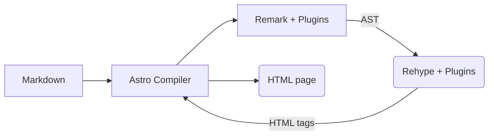

import TextLink from './../../components/astro/ui/TextLink.astro';
import Head2 from './../../components/astro/modules/posts/html/Head2.astro';
import Head3 from './../../components/astro/modules/posts/html/Head3.astro';
import Strong from './../../components/astro/modules/posts/html/Strong.astro';
import Quote from './../../components/astro/modules/posts/html/Quote.astro';

import ListTitle from './../../components/astro/modules/posts/html/ListTitle.astro';
import ListItem from './../../components/astro/modules/posts/html/ListItem.astro';

import Image from './../../components/astro/modules/posts/html/Image.astro';

import CodeSnippet from './../../components/astro/modules/posts/html/CodeSnippet.astro';

export const components = {
	a: TextLink,
	h2: Head2,
	h3: Head3,
	strong: Strong,
	img: Image,
	pre: CodeSnippet,
}

Markdown is commonly used to store textual contents when building a site with Astro. During the build process, Astro will take
all markdowns transform them into its HTML equivalent. Users can then style the markups with CSS however they wish.

However, customization through CSS is pretty limited as customizing the actual markup or behavior is out of the table. To allow
greater degree of customization, users can opt-in to [MDX](https://docs.astro.build/en/guides/integrations-guide/mdx/).

MDX allows users to utilize custom components with markup-like syntax similar to how we use those components in Astro files or JSX.

```markdown title=Using components in MDX
---
title: 'Hello World!'
publishedAt: 2024-12-17
---
import MyComponent from 'path/to/component.astro';

<MyComponent>
  Hello World!
</MyComponent>
```

However,

Not only allowing usage of custom components with markup-like syntax, MDX also allows user to re-map HTML elements into custom components
by exporting the mapping as `components` constant.


```markdown title=Replacing default elements with custom elements
---
title: 'Hello World!'
publishedAt: 2024-12-17
---

import Head1 from '../../components/Head1.astro';

export const components = {
  // Replace <h1> with Head1
  h1: Head1,
}
```

However, Astro documentation doesn't thoroughly explain about the degree of customization that users can do through this syntax.

In this post, we are going to explore the customization of default elements through `components`

Astro ships with a built-in support for code snippets powered by [Shiki](https://shiki.style/) (and [Prism](https://docs.astro.build/en/guides/syntax-highlighting/#markdown-code-blocks)).
By default, it provider syntax highlighting for:

<dl class=":uno: space-y-2">
  <ListTitle class="font-normal">
    All code fences (\`\`\`) defined in Markdown and MDX files.
  </ListTitle>
  <ListTitle class="font-normal">
    Content defined with [`<Code />`](https://docs.astro.build/en/guides/syntax-highlighting/#code-) or [`<Prism />`](https://docs.astro.build/en/guides/syntax-highlighting/#prism-) component within `.astro` files.
  </ListTitle>
</dl>


While it's definitely enough for most cases, sometimes you might want to add some additional features like adding a copy to clipboard button or just want to style and make it yours without touching the syntax highlighter internals too much.

This post will guide you through customizing the default code snippets in markdown files and transform them into something like what you currently see in this site.

<Quote>
 I will be using [Vue](https://vuejs.org/) to handle interactivity in this post, but the functionality itself can be implemented in other frameworks, including pure JavaScript.
</Quote>

## Deconstructing the Code Snippet

Before moving on to the actual customization of the snippet, we need to understand how Astro handles markdown files.

For each markdown file, Astro will parse the content using a processor called [remark](https://github.com/withastro/astro/tree/main/packages/markdown/remark),  which is a part of the
[unified](https://unifiedjs.com/) toolchain. From the markdown, remark will produce an [abstract syntax tree](https://en.wikipedia.org/wiki/Abstract_syntax_tree) (AST). The AST will
then be transformed into HTML tags using another processor in the same toolchain: [rehype](https://github.com/rehypejs/rehype).

<Quote>
  You might be wondering why we need to transform the markdown into an AST and not directly use something like RegExp.

	<br />

  This is because markdown (and HTML) is not a [regular language](https://en.wikipedia.org/wiki/Regular_language). Trying to parse non-regular language with **regular** tends to be error prone.
</Quote>

The functionality of remark and rehype can be augmented using [plugins](https://unifiedjs.com/learn/guide/create-a-rehype-plugin/) that provides additional features,
such as custom syntax and syntax highlighting. Astro enables [GitHub-flavored markdown](https://github.github.com/gfm/) and [SmartyPants](https://github.com/silvenon/remark-smartypants)
plugin by default.

The diagram below shows a simplified pipeline of markdown transformation to HTML that occurs during the build process.



When processing code blocks, the process above will output HTML tags similar to the following:

```html title=Example HTML output of a code block. Looks pretty complex isn't it?, no-lang
<pre class="astro-code github-dark" style="background-color:#24292e;color:#e1e4e8;overflow-x:auto" tabindex="0" data-language="js">
	<code>
		<span class="line">
			<span style="color:#F97583">&lt;!</span>
			<span style="color:#E1E4E8">doctype html</span>
			<span style="color:#F97583">&gt;</span>
		</span>
		<span class="line">
			<span style="color:#E1E4E8">&lt;</span>
			<span style="color:#85E89D">html</span>
			<span style="color:#B392F0"> lang</span>
			<span style="color:#F97583">=</span><span style="color:#9ECBFF">"en"</span>
			<span style="color:#E1E4E8">&gt;</span>
		</span>
		<span class="line">
			<span style="color:#E1E4E8">  &lt;</span>
			<span style="color:#85E89D">head</span>
			<span style="color:#E1E4E8">&gt;</span>
		</span>
		<!-- and the rest of the tags -->
	</code>
</pre>
```

This HTML tags will then be used by Astro to replace code blocks during the markdown
transformation process into an HTML page.

## Replacing The Default Code Snippet

Our first step to customize the code snippet is by replacing the default component with
a custom component that wraps the original one using Astro [`<slot />`](https://docs.astro.build/en/basics/astro-components/#slots).

To do that, we can assign a custom mapping for HTML elements by exporting a new constant
called `components` in our MDX files.

```markdown title=hello-world.mdx
---
title: 'Hello World!'
publishedAt: 2024-12-17
---

import CodeSnippet from '../../components/CodeSnippet.astro';
import { AstroComponentInstance } from 'astro/runtime/server/index.js'
import { AssertionError } from 'assert'
import { transform } from 'typescript'
import { withScopeId } from 'vue'
import { table } from 'console'
import { constants } from 'buffer'

export const components = { // [!code highlight]
	// in MDX, code snippets are defined with <pre>  // [!code highlight]
	pre: CodeSnippet, // [!code highlight]
} // [!code highlight]
```

We can then define `CodeSnippet` as:

```astro title=CodeSnippet.astro
<figure>
	<figcaption>
		This is a caption
	</figcaption>

	<slot />
</figure>

```

Save the file and we will be greeted by this weird element.


So what's happening here? Why does wrapping the code block in a `<figure>` element ruins the structure entirely? Well it turns out, we replaced
the entire `<pre>` element with `<figure>` as shown in the following snippet.

```html title=Should we replace the <pre>?
<figure>
	<figcaption>
		This is a caption
	</figcaption>

	<code>
		<span class="line">
			<span style="color:#F97583">&lt;!</span>
			<span style="color:#E1E4E8">doctype html</span>
			<span style="color:#F97583">&gt;</span>
		</span>
		<span class="line">
			<span style="color:#E1E4E8">&lt;</span>
			<span style="color:#85E89D">html</span>
			<span style="color:#B392F0"> lang</span>
			<span style="color:#F97583">=</span><span style="color:#9ECBFF">"en"</span>
			<span style="color:#E1E4E8">&gt;</span>
		</span>
		<span class="line">
			<span style="color:#E1E4E8">  &lt;</span>
			<span style="color:#85E89D">head</span>
			<span style="color:#E1E4E8">&gt;</span>
		</span>
		<!-- and the rest of the tags -->
	</code>
</figure>
```

Well, that's **not** what we wanted at all! We don't want to remove the `<pre>` entirely as we need to preserve
the code formatting. Since we need
